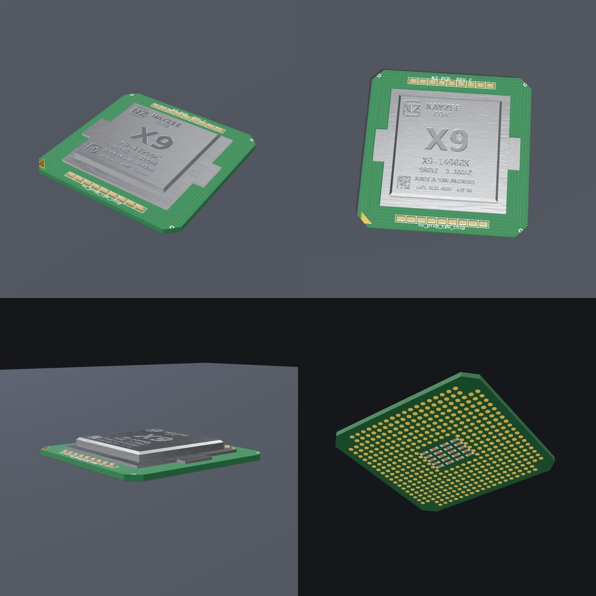

# Scripts

FiveM scripts and assets by NayZeeeDev.

| Folder | What it is |
|---|---|
| [`nz_cpuchip/`](nz_cpuchip/) | **CPU chip prop** (`nz_prop_cpu_chip`) – drop-in FiveM resource: streamed model + archetype, spawn/hold/inspect exports, usable-item hooks for ox_inventory / qb-core / esx, inventory icon |
| [`tools/nz_cpuchip_builder/`](tools/nz_cpuchip_builder/) | Generator that builds the chip from scratch (mesh, textures, CodeWalker XML, glTF) so it can be re-styled and rebuilt |
| [`tools/cwtool/`](tools/cwtool/) | Command-line CodeWalker XML -> `.ydr` / `.ytd` / `.ytyp` converter (works on Linux too) |



## Quick start – CPU chip

```
ensure nz_cpuchip
```

Then `/cpuchip spawn` in game, or `exports.nz_cpuchip:SpawnChip()` from your own
client script. See [`nz_cpuchip/README.md`](nz_cpuchip/README.md) for the item
definitions and the full export list.
