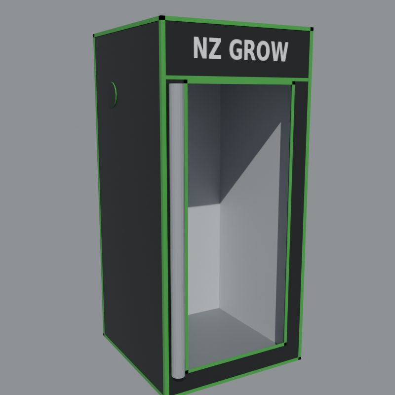
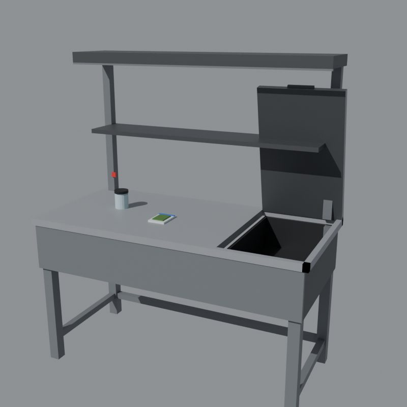

# nayzeee-drugempire

A drug empire for FiveM, inspired by Schedule I. It starts with a text from an unknown number and grows into a lab in a stolen RV, first person growing and cooking, mixing, customers, dealers and deliveries, all run from a phone app. ESX, QBCore and QBox are supported.

 

## How a player starts

1. **The text.** A while after they load in, an unknown number texts them with a pin. They press `Y` to go or `Backspace` to ignore. An ignored text comes back later.
2. **Uncle Benson.** The pin leads to a hidden spot (one of several, picked per player). Benson sits in a wheelchair, talks them through the job (with dialogue choices) and sends them to steal an RV.
3. **The RV.** The RV is parked at a random, heavily guarded spot (Lost MC with guns). They take it (optional wanted level and police alert) and drive it back to Benson.
4. **The kit.** Benson hands over 2 pots, soil, an OG Kush seed, baggies, a watering can, trimmers and a packaging station. The **Empire** app installs on their phone (lb-phone, YSeries, qs-smartphone, or `/empire` on screen), and Benson's old customers are already in it.
5. **The lab.** They walk to the back of the RV (not the door) and go inside. The interior is the K4MB1 `shell_trevor` if it's streamed, otherwise the base-game inside of Trevor's trailer. They can place equipment anywhere inside.

From there the **Journal** in the app walks them through growing, bagging, samples, deals, mixing, dealers, meth, shrooms and cocaine.

## Highlights

- **First person interactions, like the game.** A fixed camera on the station and the mouse: drag to cut the soil bag, hold to pour soil, click the cap off the seed vial, drop the seed in the hole, click the soil chunks to bury it, pour water over the target, fill the can at the tap, click buds to harvest, pour acid, stir, smash the tray, and so on. `A`/`D` rotate the view and `Esc` leaves. All of it comes from data in `config/stations.lua`.
- **Packaging bench.** Drop the bud in the bag, drag to zip it, and the right end of the table lifts up so you can drop the bag in the drawer. Jars get a lid instead. The rest of a batch packs itself.
- **Custom props** in `stream/`: grow tent (open door, rolled flap, light panel), packaging bench, bench lid, zip bag, jar and jar lid. If they aren't streamed, everything falls back to base-game props.
- **Weed, meth, shrooms and cocaine.**
  - Weed: 4 strains, plus soil types, fertilizer, PGR, speed grow, grow lights, the grow tent and a drying rack (+1 quality).
  - Meth: chemistry station, then the lab oven, then smash the tray.
  - Shrooms: spawn station, then the mushroom bed (it needs misting).
  - Cocaine: coca plants, drying rack, cauldron, then the lab oven.
- **Mixing.** 16 ingredients and 34 effects with the game's replacement rules. Value is base price × (1 + effect multipliers). Mixed products are shared server-wide and get a random name, e.g. "Blue Cheese Kush".
- **Customers.** 24 customers in 7 regions, each with standards, favourite effects, relationship (Hostile to Loyal), addiction and connections. Win new ones with free samples. They text deal requests with a product, amount, place and price. You can accept, counter or decline. If you no-show, the relationship drops.
- **Dealers.** Hire them, stock them with bagged product and assign customers. They sell on their own, keep a cut, and you collect the cash in person.
- **Deliveries.** 4 shops (hardware, Gas-Mart, Oscar's Equipment, Benson's Supply). Orders go to a dead drop or straight into the RV for a fee.
- **Ranks.** Street Rat I to Kingpin V (55 levels). Equipment, drugs, regions, shop items and dealers unlock as you level.
- **Empire app** in the NAYZEEE UI style: messages with deal buttons, journal, products (set your asking price), contacts, map, dealers, deliveries, and RV locate / tow.
- **Server-authoritative.** Every action is claimed, then finished. The server re-checks ownership, distance, items, state and timing, and a finish that comes faster than the action allows is logged or kicked. Payouts, yields and prices never come from the client.
- **0.00ms idle.** Nothing loops while you aren't doing something:
  - Peds, boxes and prompts use ox_lib points, so they only exist up close.
  - The interaction camera runs only while it's open.
  - Pot labels draw only while you're inside the RV.
  - Growth is computed from timestamps, so no timers tick.
  - The server has one heartbeat thread per minute.

## Install

1. Dependencies: [ox_lib](https://github.com/overextended/ox_lib), [oxmysql](https://github.com/overextended/oxmysql) and OneSync.
2. Drop `nayzeee-drugempire` into `resources` and add `ensure nayzeee-drugempire` **after** your framework, inventory, target and phone.
3. Add the items:
   - ox_inventory: `install/items_ox_inventory.lua` (recommended, because products carry metadata)
   - qb-core: `install/items_qb.lua`
   - ESX: `install/items_esx.sql`
   - Item images go in your inventory's image folder, named after the item, e.g. `nz_weed.png`.
4. The tables are created on start (`install/nayzeee-drugempire.sql` if you'd rather create them by hand).
5. Optional: stream the K4MB1 `shell_trevor` for the RV interior. Without it, Trevor's trailer interior is used.
6. Staff permission: `add_ace group.admin nzde.admin allow`

## Configuration

- `config/main.lua`:
  - integrations and money
  - police
  - **story**: Benson's spots, model and wheelchair; RV spots and guards; starter kit
  - **RV**: model, the rear entry point, interior offsets, tow lots
  - ranks and XP, deals, dealers, phone, UI theme
- `config/products.lua`: drugs and base prices, effects (value multiplier, colour), ingredients and mixing rules, product names.
- `config/stations.lua`:
  - every placeable (model, unlock, camera)
  - growing times and yields, soils, additives, processing times
  - **the first person steps** for every action
- `config/customers.lua`: standards, relationship rules, regions, meeting spots, customers and dealers.
- `config/shops.lua`: delivery shops, prices, dead drops, and the master item list.
- `config/server.lua`: Discord webhook, exploit action (`log` / `kick`), save interval.

Stand where you want something and run `/nzdecoords` to copy a `vec4(...)`. Benson's spots, the RV spots, the meeting spots and the dead drops are rough outdoor positions. Peds and props snap to the ground, so check their X/Y once in game.

### Theme / UI style

The UI uses the **NAYZEEE UI** system: Lexend type, true-black surfaces, teal `#08afa2` and red `#e5484d`. It has the chamfered window with the mark and teal rail, rows, chips and edge-accent toasts, a transparent objectives / deals HUD (top left, like the game) and a key-hint overlay for the first person interactions. Every accent comes from `Config.UI.theme`.

To preview every screen in a browser, open the page through any static server:

- `web/index.html#hud`, `#text`, `#dialogue`, `#ix`, `#pack`, `#mix`, `#rack`, `#give`, `#place`, `#levelup`
- `web/phone/index.html#home`, `#thread`, `#contacts`, `#map`, `#dealers`, `#deliveries`

## Custom props

`stream/` holds `nz_growtent`, `nz_packbench`, `nz_packbench_lid`, `nz_zipbag`, `nz_jar`, `nz_jar_lid` and `nz_drugempire.ytyp` (registered with `data_file 'DLC_ITYP_REQUEST'`). Each model has an embedded texture and collision.

The props are built from code, so you can change them:

- `tools/props/build_props.py` builds every model with Blender (the `bpy` module) and Sollumz, then exports CodeWalker XML. `tools/props/source/nz_drugempire_props.blend` is the result, if you want to edit it in Blender.
- `tools/props/make_ytyp.py` writes the archetype file.
- `tools/props/xml2bin` is a small .NET tool on top of CodeWalker.Core that turns the XML into `.ydr` / `.ytyp` and loads every file back as a check. Run it with `dotnet run -p:CodeWalkerCore=<CodeWalker>/CodeWalker.Core -- <xml dir> <out dir>`.
- `tools/props/render_preview.py` renders the pictures in `docs/`.

The bench lid's origin sits on its back hinge, and the script lifts it by rotating it on X (`Config.Stations.packer.lid`). The bag, drawer and product spots on the bench are `anchors` in the same entry.

## Commands

- `/empire` (or `F7`): open the Empire app on screen
- `/nzdecoords`: copy your position
- `/empireadmin stage <id> <none|texted|meet|steal|setup>`: move a player through the story (`setup` gives them the RV and the app)
- `/empireadmin xp <id> <amount>`, `kit <id>`, `water <id>`, `info <id>`, `reset <id>`

## Tests

Run `tests/run.sh` (needs `lua5.4`). It syntax-checks every file, then loads the real server code with stubbed natives and plays a character all the way through:

- **Story:** the text, ignoring it, Benson, stealing the RV, the kit
- **Lab:** placing equipment in the RV, soil, seed, the tap, watering, growing, harvest, packaging, the grow tent's boost
- **Selling:** samples, deals, counter offers, no-shows, mixing, deliveries, dealers
- **Phone and saving:** the phone data call, saving, unloading on disconnect
- **Exploits:** instant finishes, out-of-bounds placement, touching other people's equipment, skipping the story

`lua5.4 tests/export_config.lua .` regenerates `web/preview-data.js` for the browser previews.

## Notes

- Only the owner can enter their RV for now.
- lb-phone is fully supported. YSeries and qs-smartphone change their custom-app exports between versions. If the app doesn't appear, adjust the adapter in `bridge/phone/client.lua`; `/empire` always works.
- Products keep their identity (mix, quality) through item metadata. Use ox_inventory, a recent qb-inventory, qs-inventory or codem. The plain ESX inventory has no metadata, so products fall back to their base drug.
