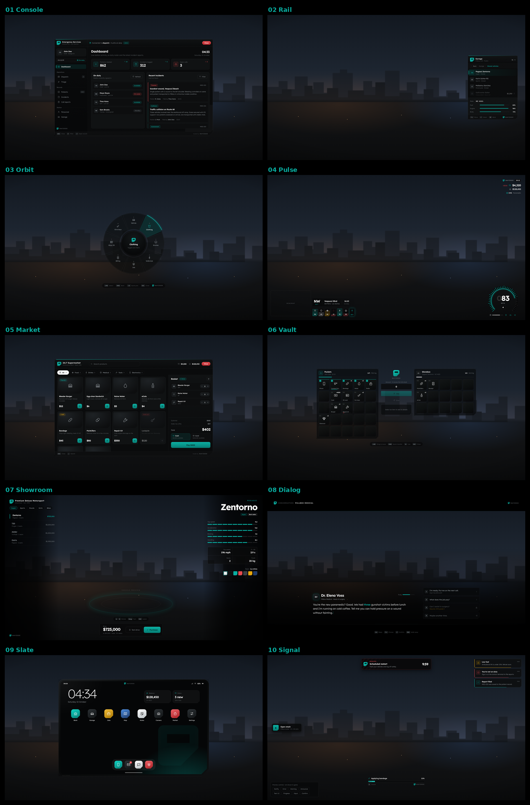
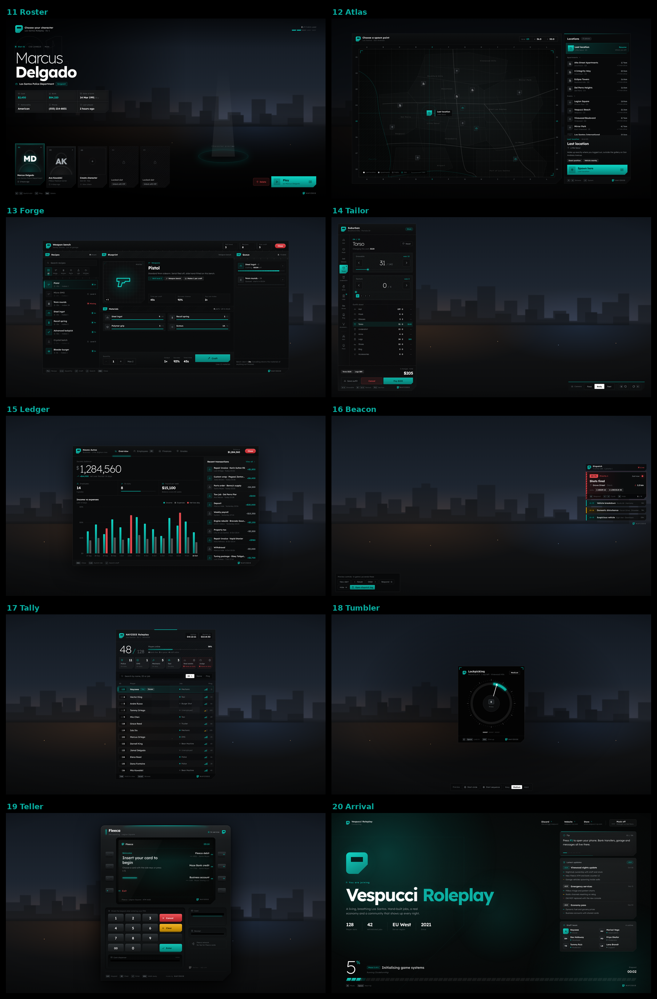
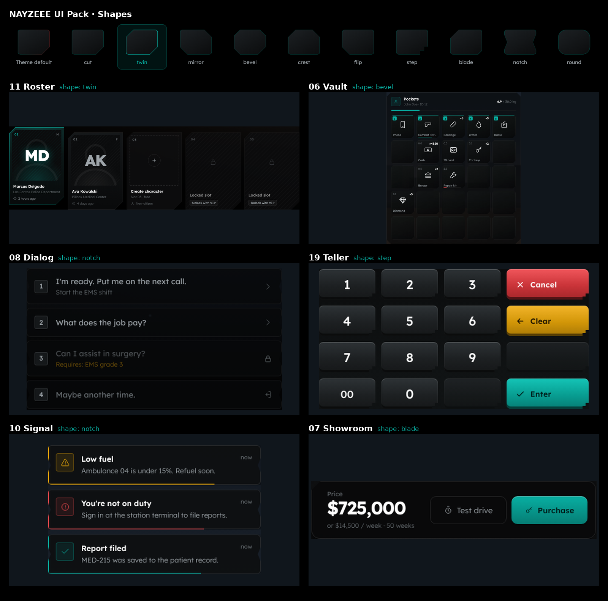
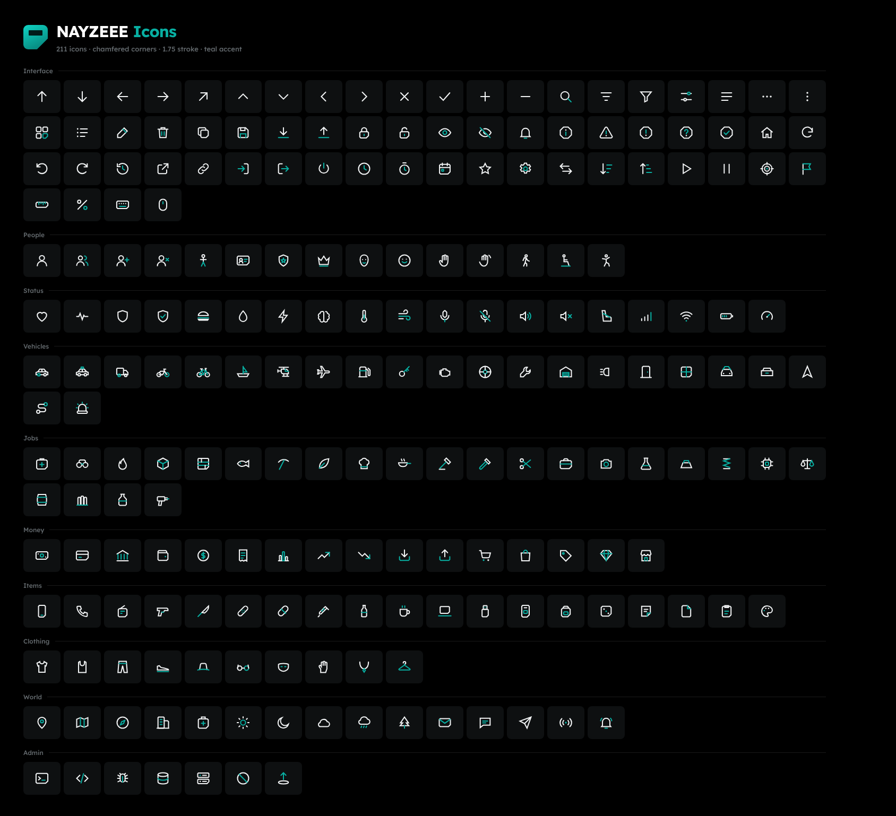

# NAYZEEE UI Pack




Twenty FiveM NUI styles that each look different but are all clearly NAYZEEE. Open `index.html` in a browser to see every theme live.

| # | Theme | Use it for |
|---|-------|-----------|
| 01 | **Console** | MDT, EMS / PD panels, boss menus, admin tools |
| 02 | **Rail** | Garages, job menus, any list menu (arrow-key driven, submenus) |
| 03 | **Orbit** | Radial interaction wheel, emotes, vehicle controls |
| 04 | **Pulse** | HUD: status, voice, street, wallet, speedometer |
| 05 | **Market** | Shops with categories, search and a basket |
| 06 | **Vault** | Inventory, stashes, trunks (drag and drop, split, hotbar) |
| 07 | **Showroom** | Dealerships or any full-screen 3D-model preview |
| 08 | **Dialog** | Cinematic NPC conversations |
| 09 | **Slate** | Tablet / laptop with apps (Bank and Notes included) |
| 10 | **Signal** | Notifications, announcements, progress bar, key prompt, input and confirm dialogs |
| 11 | **Roster** | Multicharacter select (play, create, delete with typed confirm) |
| 12 | **Atlas** | Spawn selector on a drafted map |
| 13 | **Forge** | Crafting benches, labs, cooking (materials, queue) |
| 14 | **Tailor** | Clothing store, barber, character creator appearance |
| 15 | **Ledger** | Boss / society menu: funds chart, staff, payroll, grades |
| 16 | **Beacon** | Police / EMS dispatch alerts and a dispatch log |
| 17 | **Tally** | TAB scoreboard with job counters |
| 18 | **Tumbler** | Lockpick / hacking skill-check minigames |
| 19 | **Teller** | ATM with PIN pad, cash dispenser and receipt |
| 20 | **Arrival** | Server loading screen (FiveM `loadscreen`) |

## What stays the same in every theme

These are fixed in `core/nz-core.css`, so every script carries your brand:

- **The mark**: the teal chamfered tile (`.nz-mark`, sizes `xs` `sm` `lg` `xl`)
- **Type**: Lexend
- **Colour**: black surfaces, teal `#08afa2`, red `#e5484d`, white
- **The shape family**: every container uses a cut-corner silhouette from one family of 10 (see Shapes below)
- **Signature**: `<span class="nz-sig"><span class="nz-mark xs"></span>NAYZEEE</span>`, which appears in every theme

Change a token in `core/nz-core.css` once and every theme follows.

## Shapes



Every cut-corner element (windows, cards, slots, buttons, toasts) follows one shape setting, so a whole UI changes silhouette at once while the mark stays the same.

| Shape | Look |
|-------|------|
| `cut` | bottom-right chamfer (the original) |
| `twin` | top-left + bottom-right |
| `mirror` | top-right + bottom-left |
| `bevel` | all four corners (octagon) |
| `crest` | both top corners |
| `flip` | bottom-left |
| `step` | stepped bottom-right |
| `blade` | long top-left + small bottom-right |
| `notch` | V notches on the left and right sides |
| `round` | soft rounded corners |

Each theme ships with its own default (Console `cut`, Rail `mirror`, Vault `bevel`, Forge `step`…). Change it in any of these ways:

```html
<html lang="en" data-shape="bevel">            <!-- per script default -->
<div class="panel" data-shape="round">…</div>  <!-- one panel only -->
```

```lua
SendNUIMessage({ action = 'shape', data = { shape = 'bevel' } })      -- at runtime
SendNUIMessage({ action = 'open', data = { shape = 'twin', ... } })   -- any message can carry it
```

In a browser preview a small shape picker sits at the top of every theme, and `?shape=notch` in the URL works too. The gallery (`index.html`) can switch all 20 previews at once.

Corner sizes scale with each element's `--cut`, and the extra corners are capped, so they stay clear of padded content. If you build your own clipped element, use `clip-path: var(--nz-shape)` (or `var(--nz-shape-in)` inside a `.nz-frame`) instead of writing a polygon.

## Icons



`icons/` holds 211 original NAYZEEE icons (plus 34 aliases) drawn in the brand style: chamfered corners, the bigger bottom-right cut on container shapes, a 1.75 stroke, and an optional teal accent. Open `icons/index.html` to search them and click to copy.

| Use it as | How |
|-----------|-----|
| Icon font style | `<link rel="stylesheet" href="icons/nz-icons.css">` then `<i class="nzi nzi-car"></i>` (sizes `nzi-sm` `nzi-lg` `nzi-2x`…, `nzi-spin`) |
| Font Awesome drop-in | load `icons/nz-icons-fa.css` after Font Awesome, and existing `<i class="fa-solid fa-car">` markup shows the NAYZEEE icon. 344 FA names are covered; anything else keeps coming from Font Awesome |
| UI pack | already built in: `NZ.icon('car')` or `<i data-ic="car"></i>` |
| Sprite | `<svg class="nzi-svg"><use href="icons/nz-icons.svg#car"/></svg>` (works in game; browsers block it when you open the page straight from disk) |
| Files | `icons/svg/car.svg` |

Duotone: set `--nzi-accent: #08afa2` (or add `nzi-duo`) on any parent and each icon's accent detail turns teal. Works with `NZ.icon`, the sprite and the SVG files; the `nzi` classes are single-colour.

To add or change an icon, edit `icons/src/icons.js` and run `node icons/build.js` (no installs needed). It regenerates every format, including the icons built into `core/nz-core.js`.

## Using a theme in a resource

Copy `core/` and one theme folder into your resource's `html/` folder, keeping both side by side:

```
my_garage/
├─ fxmanifest.lua
├─ client.lua
└─ html/
   ├─ core/          ← nz-core.css, nz-core.js
   └─ 02-rail/       ← index.html, style.css, app.js
```

```lua
-- fxmanifest.lua
fx_version 'cerulean'
game 'gta5'

ui_page 'html/02-rail/index.html'
files {
  'html/core/*',
  'html/02-rail/*',
}
client_script 'client.lua'
```

Every theme uses the same bridge:

```lua
-- open, with data
SetNuiFocus(true, true)
SendNUIMessage({ action = 'open', data = { title = 'Garage', items = { ... } } })

-- every theme with a close button / ESC posts 'close'
RegisterNUICallback('close', function(_, cb)
  SetNuiFocus(false, false)
  cb({})
end)

-- close from Lua
SendNUIMessage({ action = 'close' })
```

The exact `data` shape and the callbacks for each theme are documented in a comment at the top of that theme's `app.js`. Quick reference:

| Theme | Messages | Callbacks |
|-------|----------|-----------|
| Console | `open` | `close`, `navigate`, `refresh`, `filter` |
| Rail | `open` | `select`, `toggle`, `change`, `close` |
| Orbit | `open` | `select`, `close` |
| Pulse | `hud`, `status`, `voice`, `location`, `player`, `vehicle` | none (no focus needed) |
| Market | `open`, `wallet` | `checkout` (return `{ ok = true }` or `{ ok = false, error = '...' }`), `close` |
| Vault | `open`, `update` | `move`, `use`, `give`, `close` |
| Showroom | `open` | `preview`, `color`, `rotate`, `testdrive`, `purchase`, `close` |
| Dialog | `open`, `node` | `select`, `close` |
| Slate | `open`, `bank` | `app`, `bank`, `note`, `close` |
| Signal | `notify`, `announce`, `textui`, `progress`, `progressCancel`, `input`, `confirm` | `progress`, `input`, `confirm` |
| Roster | `open`, `close` | `preview`, `play`, `delete`, `create` (return `{ ok, cid }`) |
| Atlas | `open` (`closable` to allow ESC), `close` | `preview`, `spawn`, `close` |
| Forge | `open`, `inventory`, `queue`, `close` | `craft`, `cancel`, `collect`, `close` |
| Tailor | `open`, `close` | `change`, `hair`, `face`, `camera`, `rotate`, `save`, `confirm`, `cancel` |
| Ledger | `open`, `update`, `close` | `hire`, `fire`, `setGrade`, `deposit`, `withdraw`, `saveGrades` (return `{ ok = false, error }` to roll back) |
| Beacon | `alert`, `cycle`, `respond`, `hide`, `log`, `close` | `respond`, `waypoint`, `close` (stack needs no focus) |
| Tally | `open`, `update`, `close` | none (hold-to-show, no focus) |
| Tumbler | `start`, `close` | `result { success, hits, cancelled }` |
| Teller | `open`, `result`, `close` | `pin`, `withdraw`, `deposit`, `transfer` (each returns `{ ok, error, balance, cash }`) |
| Arrival | FiveM loadscreen events + `window.nuiHandoverData` | none — see the header of `20-arrival/app.js` for the `loadscreen` manifest lines |

Example: Market checkout

```lua
RegisterNUICallback('checkout', function(data, cb)
  -- data.items = { { id = 'burger', qty = 2 }, ... }, data.method = 'cash' | 'bank', data.total
  local ok = lib.callback.await('shop:buy', false, data)   -- your server logic
  cb(ok and { ok = true } or { ok = false, error = 'Not enough money' })
end)
```

Example: Signal as a shared notify resource

```lua
exports('notify', function(title, text, kind)
  SendNUIMessage({ action = 'notify', data = { type = kind or 'success', title = title, text = text } })
end)
```

## Preview in a browser

Open any theme's `index.html` directly. Outside the game the core detects that it is in a browser, loads demo data, draws a fake city backdrop, and logs callbacks to the console instead of posting them. None of that runs in game: the page stays transparent and waits for `open`.

## Making a new theme

1. Copy the theme closest to what you need.
2. Keep `../core/nz-core.css` and `../core/nz-core.js` linked first.
3. Give the root element the `nz-app` class (it stays hidden until `NZ.open(el)`).
4. Use `NZ.on`, `NZ.post`, `NZ.open`, `NZ.close`, `NZ.icon` and `NZ.esc` from the core.
5. Keep the brand visible: put the mark or `.nz-sig` somewhere, and use `clip-path: var(--nz-shape)` on the main container so it follows the shape setting.

Always pass player-supplied text through `NZ.esc()` before putting it in `innerHTML`. The themes already do this.

## Compatibility notes

- Built for 1920×1080. Layouts hold down to about 1366×768.
- Icons are inline SVG from `core/nz-core.js` (`NZ.icon('car')`, or `<i data-ic="car"></i>` in HTML).
- Lexend loads from Google Fonts. For an offline server, download it into `core/` and swap the `<link>` for an `@font-face`.
