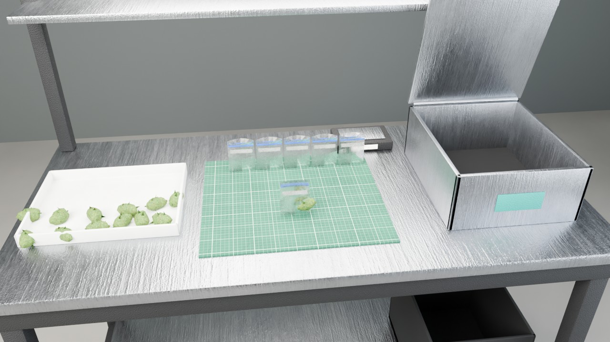
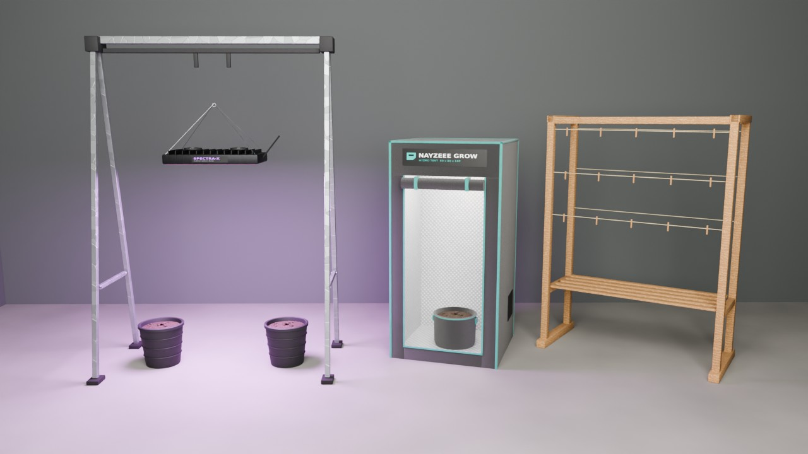
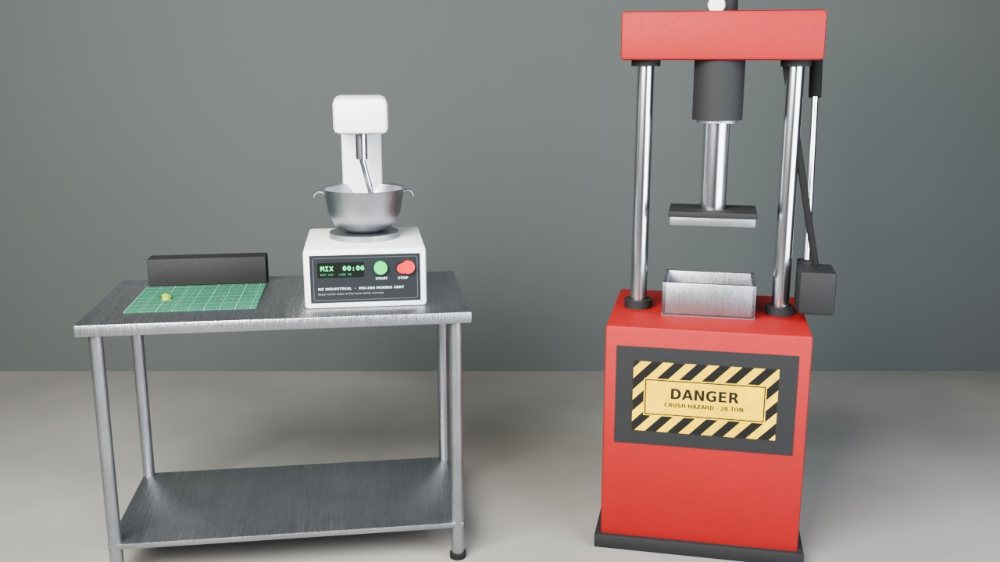
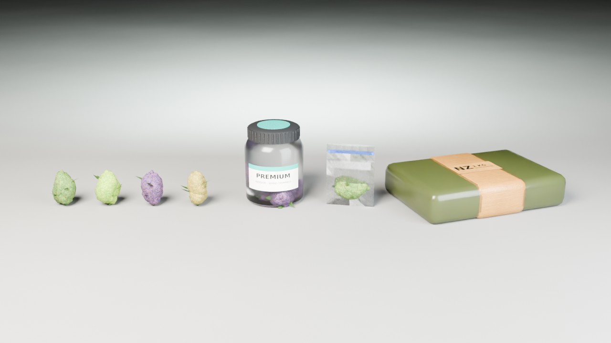

# nayzeee-weedlab

A weed production script for FiveM, inspired by Schedule I. Players find a hidden old man in a wheelchair, steal an RV from the Ballas, grow their first plants in it and work their way up to a full weed warehouse. Growing and processing are all first person, and there's no shortcut. ESX, QBCore and QBox are supported.






## How a player starts

1. **Find Uncle Benson.** He has no blip. He sits in his wheelchair at one of the spots in `Config.Benson.spots`, and with `rotate = true` he moves to a new random spot every time the server restarts. Everyone sees him at the same spot.
2. **The RV.** He sends them to take an RV from a Ballas crew: 8 armed guards around it, on Grove Street (placeholder spots). They get in, and the crew opens fire. They have to lose the Ballas (`escapeDistance` from the spot), and then the RV is theirs. That RV is their first lab.
3. **The seeds.** Benson texts them a dead drop pin. They search it and find 2-3 OG Kush seeds.
4. **The hardware store.** They buy pots, soil, a watering can, trimmers and a packaging station with their own money. There are three stores, all with blips.
5. **First grow.** They go in through the RV's side door. Inside is Trevor's trailer (or the empty K4MB1 `shell_trevor` if it's streamed). They set up, grow, harvest and bag their first product, then sell it on the street. The HUD (top left) walks them through every step.

## Labs

| Lab | Level | Growing stations | Everything placed | How |
|---|---|---|---|---|
| RV | 0 | 3 | 10 | Stolen from the Ballas |
| Small Warehouse | 6 | 12 | 30 | Bought on the tablet, pick a location |
| Weed Warehouse | 15 | 40 | 90 | Bought on the tablet. The biker weed farm interior, emptied |

- Every player is in their own routing bucket inside a lab, so nobody sees anybody else, even though everyone shares the same interiors.
- The weed farm's entity sets (plants, lights, hoses, tables, security) are switched off when you enter, so the farm starts empty.
- Each lab keeps its own equipment. The RV still works after you buy a warehouse.

## Levels

Players start at level 0. XP comes from the story, harvesting (per plant and per bud), packaging, drying, mixing new products and pressing bricks. Equipment, strains, soils, additives, ingredients and labs all unlock by level, and the store only sells what's unlocked.

| Level | Unlocks |
|---|---|
| 0 | Pots, soil, watering can, trimmers, fertilizer, baggies, packaging station, OG Kush |
| 1 | Suspension rack, halogen grow light |
| 2 | Speed Growth, Acapulco Gold |
| 3 | Grow tent, jars |
| 4 | Drying rack, PGR |
| 5 | LED grow light, Lemon Skunk |
| 6 | Small Warehouse, premium soil |
| 7 | Colombian Gold |
| 8 | Mixing station, first ingredients |
| 10 | Northern Lights |
| 11 | Full spectrum grow light |
| 12 | Brick press, the brick buyer |
| 13 | Do-Si-Dos |
| 15 | Weed Warehouse |
| 17 | Rainbow Belts |

Titles go from Seedling to Mastermind. The tablet (`/weedlab` or `F6`) shows your level, every unlock by level, and your labs (buy, GPS, tow the RV).

## First person (like the game)

When you use a station, a fixed camera points at it and you work with the mouse. `A`/`D` rotate the plant (pots) or the view (everything else), and `Esc` leaves.

- **Soil:** drag across the bag to cut it, then hold to pour it into the pot.
- **Seed:** click the cap off the vial, tip a seed in, then click the soil to bury it.
- **Water:** hold to pour the watering can over the target. Fill the can at your lab's tap.
- **Fertilizer:** hold to spray the plant (+1 quality, once per plant).
- **PGR / Speed Growth:** open the cap and pour.
  - PGR: +50% yield, -1 quality.
  - Speed Growth: +50% growth instantly, -1 quality.
- **Harvest:** rotate the plant and click every bud with the trimmers. Buds on the far side can't be cut until you turn the plant towards you.
- **Packaging station:** the product tray is on the left, the packaging in the middle and the hatch on the right. The buds lie on the tray, and the baggies (or jars) stand in a row on the mat. For each package:
  1. It slides to the front.
  2. Drag a bud into it. A jar takes 5.
  3. Zip the baggie by dragging along the top, or drag the lid onto the jar.
  4. Drag it to the hatch. The hatch lifts by itself when the package gets close, the package drops in, and the hatch shuts.

  You can click the hatch any time to lift or shut it yourself. Only packages that actually went into the hatch are paid out, so leaving halfway keeps what you finished.
- **Drying rack:** drag each bud onto a clip. After 10 minutes it comes off one quality higher.
- **Mixing station:** drag the product and the ingredient into the bowl and press START. The bowl spins and you get a new product. Same rules as the game: 34 effects, 16 ingredients, and value = strain price × (1 + effect multipliers). New mixes are shared server-wide and get a random name, like "Blue Cheese Kush".
- **Brick press:** load the mould, then drag the lever down to pump. Each stroke drives the ram a third of the way, and three strokes press 20 units into a brick.

## Growing

- Growth only happens while the soil is wet, and a watering lasts 14 minutes. Nothing ticks on a timer: growth is worked out from timestamps.
- Lights only work on a **suspension rack**. Place the rack over your pots, then use "Hang a grow light" on it. Every pot inside the rack's footprint gets the boost, and the placement ghost shows the footprint. The light hangs on two ratchet hangers and rides up by itself to stay just above the tallest plant under it.
  - Halogen: 1.25×
  - LED: 15% faster than halogen
  - Full spectrum: 30% faster than halogen
- The **grow tent** has its own light and pot: 1.35× faster, but 0.75× the yield.
- Quality: the soil sets the start, fertilizer and drying raise it, and PGR and Speed Growth lower it. Trash, Poor, Standard, Premium, Heavenly.
- Strains (the coloured plants of the `nextgen_weedprops` pack): OG Kush, Acapulco Gold, Lemon Skunk, Colombian Gold, Northern Lights, Do-Si-Dos, Rainbow Belts. Each one has its own plant colour, bud colour, price, effect, growth time and yield.

### The strain plants

The plants come from the **nextgen_weedprops** pack (not included here): `ensure nextgen_weedprops` before this resource.

- Every strain has 7 growth steps: 3 small, 2 medium, 2 big. The last one is "ready to harvest".
- The plants bring their own pot and gravel. Once a seed sprouts, the script hides its own pot and soil under the plant's pot.
  - In a pot, plants show at 0.6 scale, about 1.7 m at harvest.
  - In the tent, they show at 0.48 scale, inside the tent's fabric pot.
  - Change these with `plantScale` / `plantZ` in `config/equipment.lua`.
- `ng` in `config/strains.lua` is the strain's name in the pack (`ng_prop_weed_<s|m|b>_<ng>_<a|b|c>`). Give a strain a `plant = { ... }` list to use other models (any number of steps). Add `plantPot = true` if those models have their own pot.
- Without the pack, the base-game weed plants are used and the console says so.
- In the pack, the Do-Si-Dos models use the Colombian Gold texture, so they look the same in game. The Do-Si-Dos texture is in the pack's `.ytd`, it just isn't used.

## Custom props

Everything in `stream/` was built for this script:

| Prop | What it is |
|---|---|
| `nzw_growtent` | Small grow tent: black fabric, mylar inside, teal zips, the NAYZEEE GROW logo, built-in LED panel and fabric pot |
| `nzw_suspension_rack` | Galvanised gantry with ratchet hangers. Lights hang from its hook |
| `nzw_light_halogen` | Parabolic hammered reflector, glowing bulb, ballast with brand plate |
| `nzw_light_led` | Black aluminium panel, purple LED array, heat-sink fins, two fans |
| `nzw_light_fullspec` | Six white LED bars on rails, gold-trimmed driver |
| `nzw_dryrack` | Wooden frame, slatted shelf, twine lines with 15 clips |
| `nzw_packstation` | Steel table: white product tray (left), cutting mat (middle), hatch box and drop bin (right), back shelf, light bar, scale |
| `nzw_packstation_hatch` | Animated hatch lid (origin on the hinge) |
| `nzw_mixstation` | Steel bench, mixer with control panel, START / STOP buttons, paddle |
| `nzw_mixstation_bowl` | Animated stainless bowl (spins) |
| `nzw_brickpress` | Red 20 ton press: cabinet with danger plate, chrome columns, hydraulic cylinder, gauge, mould |
| `nzw_brickpress_plate` | Animated ram + platen (slides down) |
| `nzw_brickpress_lever` | Animated pump lever (rotates) |
| `nzw_jar`, `nzw_jar_lid` | Glass jar with label, ribbed lid |
| `nzw_baggie`, `nzw_baggie_sealed` | Open and zipped baggie, see-through |
| `nzw_brick` | Pressed weed in cling film with tape and a marker label |
| `nzw_bud_green` / `_purple` / `_lime` / `_golden` | Buds with pistils and frost, one per strain colour |
| `nzw_pot`, `nzw_soil` | Ribbed plastic pot, soil surface with perlite |
| `nzw_speedgrow`, `nzw_pgr`, `nzw_fertilizer` | Bottles with their own labels (the fertilizer is a trigger sprayer) |
| `nzw_soilbag`, `nzw_wateringcan`, `nzw_trimmers`, `nzw_seedvial` | The tools you hold in first person |

- All of them share one texture dictionary, `nzw_weedlab.ytd`.
- Every surface has diffuse, normal and specular maps: brushed steel, powder coat, galvanised steel, woven fabric, crinkled mylar, wood grain, soil, frosted buds. Labels are printed on.
- The lights' LEDs and bulbs are emissive, and the script lights the room with their colour while you're inside.
- Glass and plastic are see-through.
- The animated parts are separate props that the script moves (lid, bowl, ram, lever), so they work without animation dictionaries.

### Item images

`install/images/` has a 512px render of every item except the 16 mixing ingredients (see "Images still needed" below). Every seed uses the same vial image for now. Copy them into your inventory's image folder:

- ox_inventory: `web/images`
- qb-inventory: `html/images`

The UI uses them too.

### Rebuilding the props

The props are built from code, so you can change them. Everything is in `tools/props/`:

- `texgen.py`: the procedural textures and printed labels
- `build_props.py`: models, materials and collisions (Blender `bpy` + Sollumz). Exports CodeWalker XML
- `make_ytyp.py`: archetypes
- `xml2bin/`: a small .NET tool on CodeWalker.Core. It writes the `.ydr` / `.ytd` / `.ytyp` files, loads every one back, and checks that every texture a model uses is in the texture dictionary
- `render_images.py`, `render_scenes.py`: the item images and the pictures above (Cycles)
- `build.sh`: runs all of the above

```bash
PY=<python 3.13 with bpy==5.1.2 szio==1.4.0.dev2 numpy pillow> SOLLUMZ=<Sollumz checkout> CODEWALKER=<CodeWalker checkout> tools/props/build.sh
```

`tools/props/source/weedlab_props.blend` is the result, if you'd rather edit in Blender.

## Install

1. Dependencies: [ox_lib](https://github.com/overextended/ox_lib), [oxmysql](https://github.com/overextended/oxmysql), OneSync, and the `nextgen_weedprops` plant pack.
2. Drop `nayzeee-weedlab` into `resources` and add `ensure nayzeee-weedlab` **after** your framework, inventory, target and `nextgen_weedprops`.
3. Add the items:
   - ox_inventory: `install/items_ox_inventory.lua` (recommended, because products carry metadata)
   - qb-core: `install/items_qb.lua`
   - ESX: `install/items_esx.sql`
4. Copy `install/images/*.png` into your inventory's image folder.
5. The tables are created on start. If you'd rather create them by hand, use `install/nayzeee-weedlab.sql`.
6. Optional: stream the K4MB1 `shell_trevor` for an empty RV interior. Without it, Trevor's trailer is used.
7. Staff permission: `add_ace group.admin nzwl.admin allow`

## Configuration

- `config/main.lua`:
  - integrations
  - **Benson**: spots, `rotate`, model, wheelchair, optional hint
  - **story**: RV spots, Ballas guards (positions relative to the RV, models, weapons, accuracy), escape distance, dead drop spots and seeds
  - hardware stores
  - **labs**: interiors, bounds, taps, limits, prices, entrances, the weed farm entity sets
  - RV, level curve, XP, titles, UI theme
- `config/strains.lua`: strains (bud colour, plant models, price, growth, yield, level), quality, effects, ingredients and their mixing rules.
- `config/equipment.lua`:
  - placeables and their anchors (tray, mat, hatch, bowl, ram, lever...)
  - grow lights
  - growth, soils, additives
  - processing times
  - the first person steps
- `config/shop.lua`: the store catalogue and every item's label, weight and description.
- `config/server.lua`: Discord webhook, exploit action (`log` / `kick`), save interval.

Coordinates marked "rough" in the config were picked from the map. Peds and props snap to the ground, but check them in game once: stand where you want something and run `/nzwlcoords` to copy a `vec4(...)`.

### UI

The UI uses the **NAYZEEE UI** style:

- Lexend type, true-black surfaces, teal `#08afa2` and red `#e5484d`
- the chamfered window with the mark and teal rail, rows, chips and edge-accent toasts
- the objective on the HUD (top left), and the key-hint overlay for first person

Every accent comes from `Config.UI.theme`. To preview every screen in a browser, serve the resource folder (`python3 -m http.server`) and open `web/index.html#shop`. The other screens are `#tablet`, `#unlocks`, `#pack`, `#dry`, `#mix`, `#press`, `#place`, `#choose`, `#dialogue`, `#ix`, `#hud`, `#text` and `#levelup`.

## Selling

- **On the street:** `/sellweed` (or `G`) turns selling on. Walk up to anyone on foot and press `E`. They stop and either take some of your baggies or jars, or walk off. Refusals sometimes turn into a call to the police.
  - Price = the product's value × quality (Trash 0.5× up to Heavenly 1.7×) × a little haggling.
  - Better quality gets more buyers to say yes.
  - The same person won't buy again for 15 minutes, and there's a cooldown between offers.
- **Bricks:** Leon (placeholder spot at the docks) buys pressed bricks from level 12 at 85% of their street value, 10 a day per player.
- Pay goes to `Config.Selling.account`: cash, bank, black money, marked bills or an item.
- The first sale finishes the tutorial.

## Commands

- `/weedlab` (or `F6`): the lab tablet
- `/sellweed` (or `G`): selling on / off
- `/nzwlcoords`: copy your position
- `/weedlabadmin`:
  - `benson`: where Benson is this restart
  - `stage <id> <none|steal|deaddrop|hardware|setup|pack|sell|done>`
  - `level <id> <level>`, `xp <id> <amount>`
  - `rv <id>`, `lab <id> <small|warehouse> [entrance]`
  - `kit <id>`, `water <id>`, `info <id>`, `reset <id>`

## Security

Every action is claimed, played out, then finished. On finish the server checks ownership, the lab, distance, items, level and timing again. Payouts, yields and bud counts never come from the client.

A finish that comes faster than the action allows is logged or kicked. That covers harvesting, packaging (per package), drying, mixing, pressing and searching the dead drop.

Sales name only the person you're talking to. The server checks that it's a nearby ped (not a player), then picks the product, the answer and the price itself.

## Performance

Nothing loops while you aren't doing something:

- Benson, the store clerks, dead drops and lab doors use ox_lib points, so they only exist up close.
- The labels and the grow-light drawing run only while you're inside a lab.
- The first person camera loop runs only while it's open.
- Selling mode scans for people only while it's on.
- The server has one heartbeat per minute, plus a 2 second escape check that runs only while somebody is mid RV job.

## Tests

Run `tests/run.sh` (needs `lua5.4` and `node`). It syntax-checks every file, then loads the real server code with stubbed natives and plays a character through everything (126 checks):

- **Story:** Benson, the Ballas RV, the dead drop
- **Setup:** the store, the RV lab and its 3-pot limit
- **Growing:** soil, seed, the tap, watering, fertilizer, growth, harvest
- **Processing:** packaging (with partial batches), lights on a rack, drying, mixing, the brick press
- **Labs:** buying a warehouse
- **Selling:** street sales (yes, no, the same person twice), the brick buyer
- **Exploits:** instant finishes, someone else's plant, out-of-bounds placement, locked items

`lua5.4 tests/gen_install.lua .` regenerates the install item files.

## Images still needed

Item images for the 16 mixing ingredients: square PNGs, at least 256 px, ideally on a transparent background, named after the item:

`nzw_ing_cuke.png`, `nzw_ing_banana.png`, `nzw_ing_paracetamol.png`, `nzw_ing_donut.png`, `nzw_ing_energydrink.png`, `nzw_ing_mouthwash.png`, `nzw_ing_flumedicine.png`, `nzw_ing_gasoline.png`, `nzw_ing_viagra.png`, `nzw_ing_motoroil.png`, `nzw_ing_megabean.png`, `nzw_ing_chili.png`, `nzw_ing_battery.png`, `nzw_ing_iodine.png`, `nzw_ing_addy.png`, `nzw_ing_horsesemen.png`

They go in `install/images/`.

Optional: one image per seed (`nzw_seed_<strain>.png`) if you want each seed to look different.

## Not in yet

The larger warehouse "foundation" building comes next.

Every coordinate is a placeholder. Set them when testing with `/nzwlcoords`.
