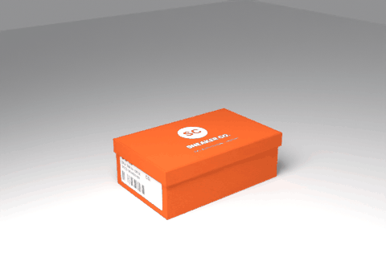

# sneaker_box

An orange sneaker box prop for FiveM with a lid hinged at the back that swings open and drops shut. Everyone nearby sees the open/close state.



- **Two models:** `nz_shoebox` (the base) and `nz_shoebox_lid`. The lid's origin is on the hinge, so the script only has to rotate it.
- **One material and a 1024 × 1024 texture atlas:** lid art, an end label with size and barcode, plain card, and kraft-brown inside.
- **Animated in code:** the lid opens with a small overshoot (`easeOutBack`) and lands with a bounce (`easeOutBounce`). No `.ycd` clip is needed.
- **Synced with a state bag:** the server keeps the open state on the networked base. Each client spawns its own local lid and animates it, so the swing stays smooth for everyone instead of jittering over the network.
- **Interaction:** works standalone with an **E** prompt. If `ox_target` is running, it uses that instead.

## Folder layout

```
sneaker_box/
  fxmanifest.lua  config.lua  client.lua  server.lua
  stream/nz_shoebox/          <- the built nz_shoebox.ydr, nz_shoebox_lid.ydr, nz_shoebox.ytyp
  tools/
    shoebox-prop-tool.html    builds the models without Blender (open it in Chrome or Edge)
  source/
    generate_model.py         builds the meshes, texture atlas and ytyp XML from code
    blender_setup.py          imports both parts, hinges the lid, keyframes the animation
    models/*.obj, *.mtl       the generated meshes (Z up, metres)
    textures/nz_shoebox.png   the generated atlas
    nz_shoebox.ytyp.xml       archetypes, with bounds that match the meshes
    viewer.html               3D preview in the browser
```

## Building the models

FiveM streams GTA's binary formats (`.ydr` and `.ytyp`). There are two ways to make them.

### With the prop tool (no Blender)

Open `tools/shoebox-prop-tool.html` in Chrome or Edge. It works the same way as the backpack prop converter:

1. Pick a colourway, add your brand text and logo, and set the size. The viewport shows exactly what gets built, and you can open and close the lid there.
2. Name it and hit **Build package**. You get `<name>.zip` containing `<name>.ydr.xml`, `<name>_lid.ydr.xml`, `<name>.ytyp.xml`, the texture folders, and an fxmanifest and config snippet.
3. In CodeWalker's **RPF Explorer**, browse into the unzipped `<name>` folder, right-click → **Import XML**, and select all three XML files.
4. Put the three built files in `stream/<name>/`, then paste the config snippet into `config.lua`. It sets the model names and the hinge offset for that size. If the name isn't `nz_shoebox`, update the `DLC_ITYP_REQUEST` line in `fxmanifest.lua` too.

The tool's **Guide** button has the full walkthrough and a troubleshooting table.

### With Blender and Sollumz

Use this if you want to change the mesh itself:

1. *(Optional)* Customise and regenerate. Put your own logo at `source/textures/logo.png` (a transparent PNG), then run `python3 source/generate_model.py`. It needs Pillow (`pip install pillow`).
2. Open Blender (4.2 or newer) with Sollumz installed. In the **Scripting** tab, open `source/blender_setup.py` and press **Run**. Press space to watch the lid animate.
3. Get ready to export. Select the lid, press **Alt+P → Clear Parent**, then **Alt+G** and **Alt+R**. That puts the hinge at the world origin, which is where GTA expects the lid's pivot. You can delete the lid's keyframes because the game animates it from Lua.
4. For each object: **Sollumz Tools → Convert to Drawable**, and convert its material to a Sollumz shader (`default.sps`). Keep the texture embedded.
5. Give the base a collision: **Sollumz Tools → Bounds → create a Bound Box** from the selection.
6. **File → Export → Sollumz (.ydr)** for each object, saving into `stream/nz_shoebox/` as `nz_shoebox.ydr` and `nz_shoebox_lid.ydr`.
7. Convert `source/nz_shoebox.ytyp.xml` to binary with CodeWalker (**RPF Explorer → Import XML**) and save it as `stream/nz_shoebox/nz_shoebox.ytyp`.

You can also run the Blender script headless, for example to re-render the preview:

```
blender --background --python source/blender_setup.py -- --render renders/ --frames frames/
```

## Install

1. Put the `sneaker_box` folder in your resources and add `ensure sneaker_box` to `server.cfg`.
2. *(Optional)* Restrict who can place boxes: set `Config.AdminOnly = true` and grant the permission:
   ```
   add_ace group.admin nz_shoebox.admin allow
   ```

## Usage

| Command | What it does |
|---|---|
| `/shoebox` | Places a box on the ground in front of you, facing you |
| `/shoebox_delete` | Removes the closest box you placed (admins can remove any) |
| **E** / ox_target | Opens or closes the closest box |

Each player can have up to 3 boxes out at once (`Config.MaxPerPlayer`). Their boxes are removed when they leave or when the resource stops.

### Server exports

Use these when another script needs boxes, such as a shoe store, a stash prop or a delivery job:

```lua
local netId = exports.sneaker_box:SpawnBox(vector3(x, y, z), heading)
exports.sneaker_box:SetBoxOpen(netId, true)   -- every nearby client animates it
exports.sneaker_box:DeleteBox(netId)
```

## Config

All the settings are in `config.lua`: the open angle and timing, interaction distance, key, the animation the player plays, limits and text.
To use your own UI, `Config.ShowPrompt` and `Config.Notify` are plain functions you can point at your own prompt and notification system.

## Logo note

The placeholder art on the box is a generic "Sneaker Co." badge. To brand it, use **Use file…** under Logo in the prop tool, or, for the Blender route, drop your own `logo.png` in and regenerate (step 1). Make sure you're allowed to use whatever logo you put on it.
